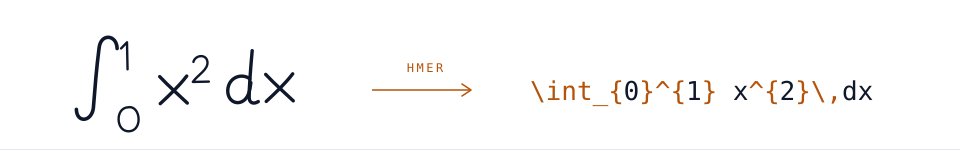

<picture>
  <source media="(prefers-color-scheme: dark)" srcset="assets/hero-dark.svg">
  <source media="(prefers-color-scheme: light)" srcset="assets/hero-light.svg">
  
</picture>

# Khoa Nguyen
### Nguyễn Minh Khoa · published as **Khoa Minh Nguyen**

**AI Engineer · AI Researcher**  
*Computer Vision · Multimodal AI · AI Systems · Smart Manufacturing*

[About](#about-me)&nbsp; · &nbsp;[Featured Work](#selected-work)&nbsp; · &nbsp;[Publications](#research)&nbsp; · &nbsp;[Open Source](#open-source)&nbsp; · &nbsp;[Toolkit](#tech-i-reach-for)&nbsp; · &nbsp;[Honors](#education--recognition)

---

## About me

I build AI systems across **research and engineering** — from mathematical formulation and controlled experiments to backend runtimes, telemetry infrastructure, and reproducible pipelines. I care about systems that can be inspected, audited, and deployed reliably.

- 🔬 **Research Assistant @ AiTA Lab, FPT University** *(Oct 2024 – Present)*.
- 🎓 Completed academic requirements for **B.Eng. in Artificial Intelligence & Data Science** at FPT University *(degree conferral expected Nov 2026)*.
- 🏭 Current research focus: **Adaptive Industrial Visual Intelligence (LG-IVI)**, specializing in language-grounded defect localization and inspection under zero- and few-shot constraints.
- 🧩 Areas of interest: Multimodal representation learning, VLM active learning, agentic research workflows, and IIoT/MES platforms.

---

## Selected work

### 🧪 [LexiChem](https://purin1410.github.io/work/lexichem/) — research + end-to-end AI system
`Completed Capstone` · `First-author APWeb-WAIM 2026 Paper`
- Natural-language to 2D/3D molecular generation through shared-latent cross-modal alignment in SELFIES space, evaluated on the L+M-24 benchmark.
- Multi-model serving pipeline with NVIDIA Triton Inference Server, RDKit chemical validation, and FastAPI backend.
- 🔗 [Read Case Study](https://purin1410.github.io/work/lexichem/)

### 🏭 [NexOps](https://purin1410.github.io/work/nexops/) — smart-manufacturing systems engineering
`Working Prototype` · `AI & Simulation Lead`
- Local-first MES/SCADA runtime connecting machine telemetry, production schedules, alarms, and shift OEE.
- Deterministic machine/shift simulations, MQTT pipelines via EMQX, and local Bambu Lab 3D printer hardware control over LAN.
- 🔗 [Read Case Study & Demo](https://purin1410.github.io/work/nexops/)

### 🔬 Research Ops — trustworthy research infrastructure
`Pre-alpha` · `Personal System`
- Human-in-the-loop research workspace designed to make scientific progress traceable and reproducible.
- Treats evidence, provenance, SQLite case state, checkpoints, and bounded agent review as first-class primitives.

---

## Research

I currently have **five accepted or published papers** spanning handwritten mathematical expression recognition, multimodal alignment, and active learning with vision-language models:

| Year | Paper | Venue | Role | Artifacts |
|:---:|---|:---:|:---:|:---:|
| 2026 | **LexiChem: Shared-Latent Alignment for Faithful Text-to-Molecule Generation in SELFIES Space** | APWeb-WAIM | **First author** | [Case Study](https://purin1410.github.io/work/lexichem/) |
| 2026 | **CorrTie: Correction-aware Tie-breaking for Active Learning with Vision-Language Models** | APWeb-WAIM | Co-author | [Paper](https://link.springer.com/chapter/10.1007/978-981-92-5699-0_26) · [Code](https://github.com/TaiDuc1001/CorrTie) |
| 2026 | **ChemAligner-T5: A Unified Text-to-Molecule Model via Representation Alignment** | ICCIES | **Co-first author** | [Paper](https://doi.org/10.1007/978-3-032-21625-0_16) |
| 2026 | **Enhancing Handwritten Mathematical Expression Recognition with Convolutional Block Attention Refinement Module and Multi-Task Learning** | JIT *(Taylor & Francis)* | Co-author | [Paper](https://doi.org/10.1080/24751839.2026.2716432) · [Code](https://github.com/trungtndev/HMER-CBARM-MTL) |
| 2025 | **Mask CoMER: Enhancing Handwritten Mathematical Expression Recognition with Masked Language Pretraining and Regularization** | ICDAR *(LNCS)* | **Co-first author** | [Paper](https://doi.org/10.1007/978-3-032-04624-6_22) · [Code](https://github.com/Neeze/Mask-CoMER) |

<a href="https://scholar.google.com/citations?user=tCq7yoQAAAAJ">View Google Scholar Citations →</a>

---

## Open source

Two merged pull requests to upstream [`sipyourdrink-ltd/bernstein`](https://github.com/sipyourdrink-ltd/bernstein):

- [`fix(trace): authenticate projection audit evidence`](https://github.com/sipyourdrink-ltd/bernstein/pull/3672) — strengthened verification by binding signed projections to integrity-checked audit evidence.
- [`fix(mcp): disclose tool host effects`](https://github.com/sipyourdrink-ltd/bernstein/pull/3673) — added explicit host-effect disclosure across MCP tool schemas and validation coverage.

---

## Tech I reach for

  

  
  
  
  
  
  

---

## Education & Recognition

- **B.Eng. in Artificial Intelligence & Data Science** — FPT University *(Graduation expected Nov 2026)*
  - Capstone: *LexiChem* (Text-to-molecule generation workbench and multi-model inference serving)
- **AI VIET NAM (AIO 2024)** — Graduate of the 4-tier AI Fellowship *(Python, Machine Learning, Deep Learning, Generative AI & MLOps)*
- **AiTA Lab** — Research Assistant *(2024 – Present)*
- 🥈 **Silver Medal** — Vietnam National Open Mathematics Olympiad for High School Students (2021)
- 🎓 **Merit Scholarship & Innovation Project Grant** — FPT University

---

  <em>Research rigor, engineering ownership, and systems that survive beyond the notebook.</em> 
  Get in touch: <a href="mailto:ngminhkhoayj2706@gmail.com">ngminhkhoayj2706@gmail.com</a> · Explore more at <a href="https://purin1410.github.io">purin1410.github.io</a>

